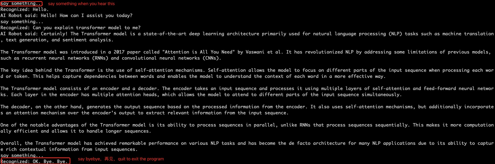

# Ask_GPT
Talk to GPT


# Dependencies
*  azure-cognitiveservices-speech 

	``` pip3 install azure-cognitiveservices-speech ```

# Instruction
1. set up speech_key, service_region in config.json ([follow instructions in this article to otabin free azure cognition service](https://blog.csdn.net/zcxey2911/article/details/128386211)).
2. register ChatLink (offer GPT service) and get ChatLink API_key ([Follow this article to obtain a ChatLink API Key](https://mp.weixin.qq.com/s?__biz=Mzg2MDk3MzM4OQ==&mid=2247483765&idx=1&sn=ef5a79ee76ae552b2b44c04651c0466c&chksm=ce1f7157f968f841c57b9f19587f7d40a578c28c701cf182e3a96a55ff2f6cc64043b8e1f8d9#rd)).  Use our test key in config.json offer 10 free chats. 
3. run this command to talk to GPT:
``` python3 Ask_GPT.py ```

# Demo
